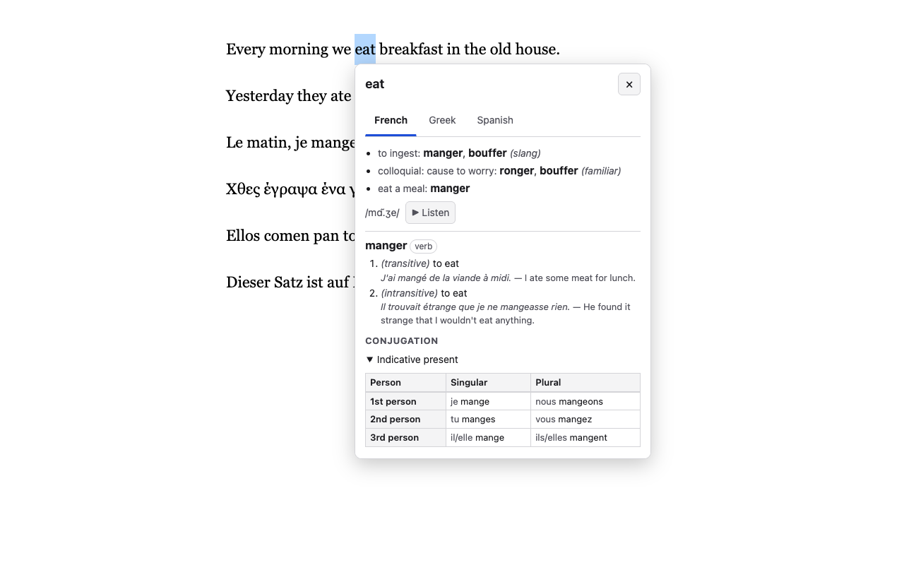

# Lekseis Hover

A Chrome extension for language learners. _Λέξεις_ (lékseis) is Greek for "words".

Select a word (double-click it) or a phrase on any page.

**On a page in your own language** (English), you see it in every language
you're learning, one tab each:

- Wiktionary's translations, grouped by meaning, with gender and usage labels
  (_eat_ → French _manger_, _bouffer_ (slang); _house_ → _maison_ f.);
- every form of the main translation: _comer_ conjugated in all tenses,
  _beau_ by gender and number;
- for a phrase, a machine translation into each language.

**On a page in a language you're learning**, you see:

- **what it means** in English, with examples, pronunciation and audio;
- **what form it is**: _mange_ is the "first/third-person singular present
  indicative of _manger_";
- **all its other forms**:
  - every tense of a verb, by person and number, with subject pronouns;
  - an adjective by gender and number (German and Greek: by case too);
  - a noun by number and case.

Nothing happens until you select something, so ordinary reading and
hovering aren't interrupted.



## Contents

- [Using it](#using-it)
- [Language notes](#language-notes)
- [Local development](#local-development)
- [How it works](#how-it-works)
- [Testing](#testing)
- [Releasing to the Chrome Web Store](#releasing-to-the-chrome-web-store)
- [Privacy](#privacy)
- [Known limitations](#known-limitations)

## Using it

After installing, the settings page opens. Choose your language (English by
default) and tick the languages you're learning.

| To…                                   | Do this                                                                 |
| ------------------------------------- | ----------------------------------------------------------------------- |
| Look up a word                        | Double-click it                                                         |
| Translate a phrase                    | Drag across it to select it                                             |
| Switch language                       | Click a tab, or use <kbd>←</kbd> <kbd>→</kbd> when a tab has focus      |
| Look up from the keyboard             | Select text, press <kbd>Alt</kbd>+<kbd>Shift</kbd>+<kbd>L</kbd>         |
| Look up from the mouse menu           | Select text, right-click → **Look up "…"**                              |
| Keep the popup open to read or scroll | Click inside it; close with <kbd>Escape</kbd>, × or a click elsewhere   |
| Select text without a lookup          | Settings → only look up while holding <kbd>Alt</kbd>                    |
| Force a site on or off                | Toolbar button → choose a rule for the site                             |
| Translate more each day               | Settings → **Translation limit** → enter your email (optional)          |

The page's `lang` attribute, or Chrome's language detection, decides which
way a lookup goes. Text in your language is translated into the languages
you're learning, and text in one of those is explained in your language. A
page with no detectable language is assumed to be in yours. Passages marked
with their own `lang` are handled separately, so a French quote in an English
article is explained, not translated. Text in any other language is ignored.

Selections longer than 300 characters are ignored, since those are usually
for copying.

The keyboard shortcut can be changed at `chrome://extensions/shortcuts`. When
the shortcut opens a lookup, focus moves into the popup, and <kbd>Escape</kbd>
returns it to where it was.

## Language notes

24 languages are available. Inflection tables are as good as Wiktionary's data
for each one.

- **Your language:** translations grouped by meaning come from English
  Wiktionary's translation tables, so they're only available when your
  language is English. With another language, single words and phrases are
  machine translated, then the result is looked up for its forms.

- **Spanish:** choose your variety in settings. It decides which
  second-person forms the tables show.
  - _Spain:_ _tú_ and _vosotros_.
  - _Latin America:_ _tú_ and _ustedes_, which takes the third-person plural form.
  - _Río de la Plata:_ _vos_ and _ustedes_. _Vos_ has its own forms in the
    present, present subjunctive and imperative (_comés_, _comé_), and shares
    _tú_'s elsewhere.
  - Pages from any region (`es-MX`, `es-AR`, …) are treated as Spanish, because
    Wiktionary has a single Spanish dictionary.
- **Greek:** verb tables are named by tense and aspect:
  - present;
  - imperfect (continuous past);
  - simple past (aorist);
  - future continuous;
  - simple future;
  - the dependent (the form used after να and θα).

  Active and passive voices get separate tables. Nouns and adjectives decline
  by case, including the vocative.
- **Māori:** verbs don't conjugate by person, so there are no verb tables;
  their passive forms are listed instead (_kai_ → _kainga_, _kōrero_ →
  _kōrerotia_). Nouns with an irregular plural show it beside the singular
  (_tamaiti_ / _tamariki_, _tangata_ / _tāngata_), and selecting a plural
  explains it as the plural of its singular. Wiktionary spells Māori with
  macrons, so text written without them (_korero_ for _kōrero_) may not be
  found. MyMemory's Māori machine translation is unreliable; the dictionary's
  meanings are the ones to trust.
- **German:** adjectives have strong, weak and mixed tables, with comparative
  and superlative. Nouns decline by case and number.
- **French, Spanish, Italian, Portuguese, Catalan, German, Dutch, Greek:**
  verb tables show subject pronouns.

## Local development

### Prerequisites

- [Bun](https://bun.sh) 1.4 or later (package manager, script runner)
- Google Chrome or Chromium 128 or later
- `zip`, only for packaging a release (preinstalled on macOS and most Linux)

### Install and load the extension

```sh
git clone git@github.com:joshuadiablito/lekseis-hover.git
cd lekseis-hover
bun install
bun run build
```

Then load it into Chrome:

1. Open `chrome://extensions`.
2. Turn on **Developer mode** (top right).
3. Click **Load unpacked** and choose the `dist/` folder.
4. The settings page opens; tick a language you're learning. Open any English
   page and double-click a word.

### The edit–reload loop

```sh
bun run dev
```

This rebuilds `dist/` whenever a source file changes. Chrome doesn't pick up
changes on its own:

| You changed                                     | To see it                                                   |
| ----------------------------------------------- | ----------------------------------------------------------- |
| Content script (`src/content/`), the popup      | Click ↻ on the extension card, then reload the web page     |
| Service worker (`src/background/`)              | Click ↻ on the extension card                               |
| Settings page or toolbar popup                  | Close and reopen it                                         |
| `public/manifest.json`                          | Click ↻ on the extension card                               |

After ↻, pages that were already open still run the old content script. The
popup says "Lekseis Hover was updated. Reload the page." until you do.

### Debugging

- **Service worker:** on the extension card, click **service worker** to
  open DevTools for it. Lookups and network requests to kaikki.org and MyMemory
  appear there.
- **Content script:** use the page's own DevTools. In the Console's context
  dropdown, choose **Lekseis Hover** to run code in the extension's world. The
  popup is `<lekseis-hover-popup>`, with its content in an open shadow root.
- **Settings:** in the service worker console, run
  `await chrome.storage.sync.get(null)` to see what's stored, or
  `chrome.storage.sync.clear()` to start over.

### Scripts

| Command             | What it does                                                         |
| ------------------- | -------------------------------------------------------------------- |
| `bun run build`     | Production build into `dist/`                                        |
| `bun run dev`       | Development build with source maps, rebuilt on change                |
| `bun run typecheck` | TypeScript for the extension, the tests and the build config         |
| `bun run test`      | Unit tests (Vitest); `bun run test:watch` to rerun on change         |
| `bun run check`     | Typecheck, tests and build: run this before committing               |
| `bun run smoke`     | End-to-end test in real Chromium, after a build (see [Testing](#testing)) |
| `bun run icons`     | Re-render `public/icons/*.png` from `assets/icon.svg`                 |
| `bun run package`   | `check`, then zip `dist/` for the Chrome Web Store                   |

## How it works

```
page ──select──▶ content script ──message──▶ service worker ──fetch──▶ kaikki.org
                  (selection, its                             └──fetch──▶ MyMemory
                   language, popup)     ◀──result──────────
```

- The **content script** runs on every http(s) page. It does nothing until
  you release the mouse after selecting text. Then it works out the text's
  language and asks the service worker for a lookup. Results are shown in a
  shadow-DOM popup, so the page's CSS can't reach it.
- The **service worker** routes the lookup by language:
  - **translate** (`translate()` in `src/background/lookup.ts`) is for text in
    your language. It reads the English word's Wiktionary translation table,
    picks the main translation per language (preferring one with no regional
    or slang label), and fetches that word's own entry for its forms.
    Phrases, and words with no dictionary translation, go to MyMemory.
    Languages are translated on demand, one tab at a time: a lookup fetches
    the English entry (`translateSource()`) and only the language whose tab
    opens first, which is the one you last chose. Other tabs ask the service
    worker for their language (`translateLanguage()`) when first shown,
    reusing the English entry already fetched, so a lookup spends one
    language's share of your MyMemory allowance, not every language's.
  - **explain** (`explain()`) is for text in a language you're learning. It
    fetches the word's entry, follows an inflected form to its lemma
    (_mange_ → _manger_), and machine-translates the text into your language.

  Results are cached in memory, the shared English entry and each language
  separately. Fetching happens in the service worker because
  kaikki.org sends no CORS headers, and only the extension's host permissions
  get around that.
- **Inflection tables** are built from Wiktionary's tagged forms
  (`src/shared/inflections.ts`). Person or case goes down the side, gender and
  number across the top, with one table per tense, mood or declension type.
  Tags that only mark a variant (Spanish _vos_, German article context) put
  the forms in the same cell rather than creating new tables.

### Data sources

Both are free and need no key or account.

- **[kaikki.org](https://kaikki.org/)**: English Wiktionary as JSON
  (extracted by wiktextract). It supplies definitions, IPA, audio, the lemma
  for inflected forms, and inflection tables. The content is CC BY-SA and
  attributed in every popup that shows it.
- **[MyMemory](https://mymemory.translated.net/)**: machine translation of
  phrases. Anonymous use is limited to about 5,000 characters a day. Users
  can raise their own limit to 50,000 by entering an email address in
  settings, which is then sent to MyMemory (and only MyMemory) as the `de`
  parameter. Without it, translation still works up to the lower limit.

### Source layout

| Path                            | Role                                                                   |
| ------------------------------- | ---------------------------------------------------------------------- |
| `public/manifest.json`          | Extension manifest (Manifest V3); copied into `dist/`                  |
| `src/shared/kaikki.ts`          | Parses kaikki.org JSONL, filtering out its bookkeeping rows            |
| `src/shared/inflections.ts`     | Pivots tagged forms into tables                                        |
| `src/shared/word.ts`            | Word segmentation and spellings to try (case, elision)                 |
| `src/shared/settings.ts`        | Settings shape, defaults and validation (`chrome.storage.sync`)        |
| `src/background/`               | Service worker: translate and explain, MyMemory client, cache, menu    |
| `src/content/`                  | Page language, the selection, popup and its language tabs              |
| `src/options/`, `src/action/`   | Settings page and toolbar popup                                        |
| `scripts/`                      | Smoke test, icon rendering, release packaging                          |
| `test/fixtures/`                | Real kaikki.org responses used by unit tests                           |

The content script is built separately (`vite.content.config.ts`) as a single
classic script, because Chrome can't load content scripts as ES modules.

## Testing

- **Unit tests** (`bun run test`) run offline against real kaikki.org
  responses saved in `test/fixtures/`. To cover a new language quirk, save
  the word's data and write a test against it:

  ```sh
  curl https://kaikki.org/dictionary/Italian/meaning/p/pa/parlare.jsonl > test/fixtures/italian-parlare.jsonl
  ```

  The URL pattern is `/dictionary/<Language>/meaning/<1st char>/<1st 2 chars>/<word>.jsonl`.
- **Smoke test** (`bun run build && bun run smoke`) loads `dist/` into
  headless Chromium and serves an English page with French, Greek, Spanish and
  German passages. It double-clicks words and drags across phrases, against
  the live APIs, and checks the popups. It also checks that hovering alone,
  and German (not being learned), do nothing. Screenshots are
  saved to `smoke-output/`. It needs Playwright's Chromium; run
  `bunx playwright install chromium` once if it isn't installed.
- **By hand:** automated checks can't prove the popup is usable. Before a
  release, try it with the keyboard only (shortcut, Tab through the popup,
  Escape) and with a screen reader.

## Releasing to the Chrome Web Store

See **[docs/chrome-web-store.md](docs/chrome-web-store.md)**. It covers the
first submission, the store listing, the privacy answers and updates.

## Privacy

See **[PRIVACY.md](PRIVACY.md)**. In short: the text you look up is sent to
kaikki.org and MyMemory to be looked up. If you enter an email address for a
higher translation limit, it's sent to MyMemory only. Nothing else leaves your
browser, and there is no analytics or account.

## Known limitations

- Compound tenses (_passé composé_ and similar) are not shown; Wiktionary lists them only as "avoir + past participle".
- Definitions are always in English, because they come from English Wiktionary. Your chosen language applies to translations only.
- Single-word machine translation is often wrong, so it's labelled as machine translation and shown after the dictionary's analysis.
- A word split across elements (`<b>ma</b>nger`) is not detected.
- Some sites' Content-Security-Policy blocks Wikimedia audio. **Listen** then opens the recording in a new tab.
- On touch screens, select the text and use the context menu or the keyboard shortcut; the automatic lookup follows a mouse selection.
- Translating an English word that has several meanings shows the forms of the most common translation (Wiktionary's, with MyMemory breaking ties); the other meanings' translations are listed above it.
- Wiktionary's coverage varies by language. Common Greek words have full tables, but rarer ones may have no translation or a stub entry. The popup then shows a machine translation and says that no table is available, rather than guessing.
